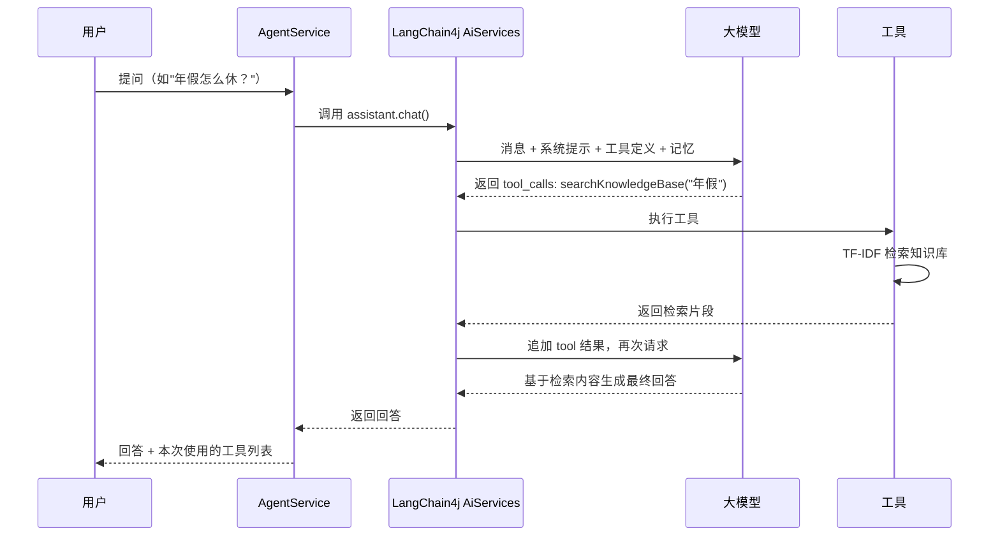

# kb-agent · 企业知识库智能问答 Agent

基于 **Spring Boot 3 + LangChain4j** 实现的智能客服 / 知识库问答 Agent：
大模型通过 **Function Calling（工具调用）** 自主决定调用「知识库检索 / 当前时间 / 安全计算器 / 天气查询」4 个工具，
配合自研的 **TF-IDF 中文检索（RAG）** 回答企业内部制度、产品、流程类问题，显著降低模型幻觉。

- 纯 Java 17 + Maven，零数据库、零中间件，`mvn package` 打成一个 jar 即可部署
- 通过配置切换 **DeepSeek / 通义千问 / 智谱 / 豆包** 等任意 OpenAI 兼容大模型
- 知识库为 `resources/kb/` 下的 Markdown 文档，替换成真实文档即可上线
- 自带简易网页聊天界面（`http://localhost:8080`）与 HTTP 接口

## 技术栈

| 模块 | 选型 | 说明 |
|---|---|---|
| 框架 | Spring Boot 3.3.5 | Web 容器 + Bean 管理 |
| Agent 框架 | LangChain4j 1.0.0 | `AiServices` 自动完成工具调用循环 |
| 大模型 | OpenAI 兼容协议（默认 DeepSeek） | 通过 `baseUrl` 切换各家模型 |
| RAG 检索 | 自研 TF-IDF + 余弦相似度 | 中文 2-gram 分词，无第三方依赖 |
| 前端 | 原生 HTML/JS | 单页面聊天界面 |
| 构建 | Maven 3.9 + JDK 17 | 单一 fat jar |

## 架构

```mermaid
flowchart LR
    U[浏览器聊天页] -->|POST /api/chat| C[ChatController]
    C --> S[AgentService]
    S --> A[AiServices 动态代理]
    A --> M[ChatLanguageModel<br/>DeepSeek 等]
    A --> T[AgentTools<br/>@Tool 注解 4 个工具]
    A --> R[TfidfContentRetriever<br/>RAG 检索]
    A --> Mem[MessageWindowChatMemory<br/>会话记忆]
    T --> KB[(resources/kb 知识库)]
    R --> KB
```

一次对话的完整流程：



## 目录结构

```
kb-agent
├── pom.xml
├── handwritten-version/          # v1 手写 Function Calling 版（保留参考）
├── docs/
│   ├── 面试讲解.md                 # 面试高频问题与回答口径
│   └── 简历项目描述.md              # 可直接粘贴到简历的项目描述
└── src/main/
    ├── java/com/lc/kbagent/
    │   ├── config/               # 配置属性（Llm/Agent/Tool）
    │   ├── llm/LlmConfig.java    # ChatModel Bean（OpenAI 兼容）
    │   ├── agent/
    │   │   ├── KbAssistant.java  # AiServices 接口（@SystemMessage）
    │   │   ├── AgentService.java # Agent 门面：装配模型/工具/RAG/记忆
    │   │   └── AgentReply.java
    │   ├── tools/
    │   │   ├── AgentTools.java   # @Tool 工具集合（4 个工具）
    │   │   ├── ExpressionCalculator.java # 安全计算器（递归下降解析）
    │   │   └── ToolCallTracker.java      # 工具调用记录（前端展示）
    │   ├── rag/
    │   │   ├── KnowledgeBase.java        # 知识库加载与切块
    │   │   ├── TfidfIndex.java           # TF-IDF 中文检索
    │   │   └── TfidfContentRetriever.java# 封装为 LangChain4j ContentRetriever
    │   └── web/ChatController.java       # /api/chat /api/tools /api/health
    └── resources/
        ├── application.yml       # 大模型/Agent/工具配置
        ├── static/index.html     # 聊天页面
        └── kb/                   # 知识库文档（示例：虚构"星辰科技"）
```

## 快速开始

1. **申请 API Key**：到 [DeepSeek 开放平台](https://platform.deepseek.com) 注册，新用户有免费额度（约几元即可跑大量测试）；
2. **配置 Key**：编辑 `src/main/resources/application.yml`：

   ```yaml
   llm:
     api-key: sk-xxxxxxxxxxxxxxxx   # 填入你的 Key
   ```

3. **运行**：

   ```bash
   mvn spring-boot:run
   # 或打包后运行
   mvn -DskipTests package
   java -jar target/kb-agent-2.0.0.jar
   ```

4. **访问**：浏览器打开 `http://localhost:8080`，即可与 Agent 对话。

试试这些问题：

| 问题 | 期望行为 |
|---|---|
| 公司年假怎么休？ | 调用知识库检索，按《员工手册》回答 |
| 报销金额 8000 要找谁审批？ | 检索报销流程并给出结论 |
| 知识库问答产品多少钱？ | 检索《产品FAQ》回答价格 |
| 现在几点了？ | 调用 getCurrentTime |
| 帮我算 (128+64)*3 | 调用计算器工具，返回 576 |
| 北京天气怎么样？ | 调用天气工具（默认模拟数据） |
| 公司什么时候成立的？ | 检索《公司简介》回答 |

## 切换其他大模型

本项目未绑定任何单一厂商，只要模型提供 OpenAI 兼容的 `/chat/completions` 接口即可：

```yaml
# 通义千问（兼容模式）
llm:
  base-url: https://dashscope.aliyuncs.com/compatible-mode/v1
  api-key: sk-xxx
  model: qwen-plus

# 智谱
llm:
  base-url: https://open.bigmodel.cn/api/paas/v4
  api-key: xxx
  model: glm-4-flash

# 豆包（火山方舟）
llm:
  base-url: https://ark.cn-beijing.volces.com/api/v3
  api-key: xxx
  model: doubao-1-5-pro-32k-250115
```

> 提示：不同厂商的 OpenAI 兼容实现略有差异，个别厂商需在 `LlmConfig` 中按需调整请求参数。

## 技术选型：为什么用 LangChain4j？

- **生产级**：小厂 Agent 项目主流选择，工具调用循环、对话记忆、RAG 链路都是成熟封装，不用自己造轮子；
- **学习成本低**：核心只学 3 个概念 —— `AiServices`（服务代理）、`@Tool`（工具注解）、`ContentRetriever`（检索接口）；
- **可解释**：`handwritten-version/` 保留了 v1 手写版（自研 OpenAI 协议 + 自研 Agent 循环），面试时可对照讲解 Function Calling 底层原理；
- **可扩展**：新增工具只需加一个 `@Tool` 方法；升级向量检索只需替换 `TfidfContentRetriever` 实现。

## 生产化扩展点

1. **向量检索**：文档量大时把 `TfidfIndex` 换成 Embedding + Milvus/ES/Redis 向量检索；
2. **会话隔离**：`ToolCallTracker` 的 ThreadLocal 与共享 `ChatMemory` 仅适合演示，生产按 `sessionId` 隔离（`ChatMemoryProvider`）；
3. **流式输出**：接口改为 `StreamingChatModel` + SSE，体验更好；
4. **持久化**：对话日志、知识库管理入库（MySQL）；
5. **安全**：接入统一鉴权、敏感词过滤、提示词注入防护、调用限流。

## 常见问题

- **没配 Key 能启动吗？** 能。页面/接口可访问，调用 `/api/chat` 时会返回友好提示；
- **天气为什么是模拟数据？** 默认 `tools.weather.mock=true` 保证离线可演示；置为 `false` 走 Open-Meteo 免费真实天气；
- **知识库怎么换成自己的？** 直接替换/新增 `resources/kb/*.md`，重启生效；生产建议接数据库或对象存储。
