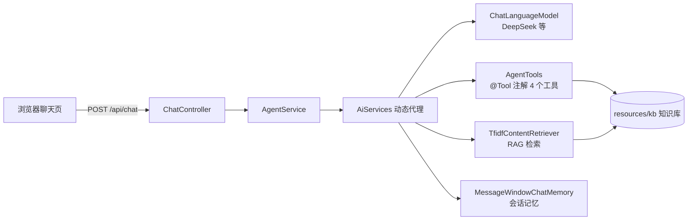
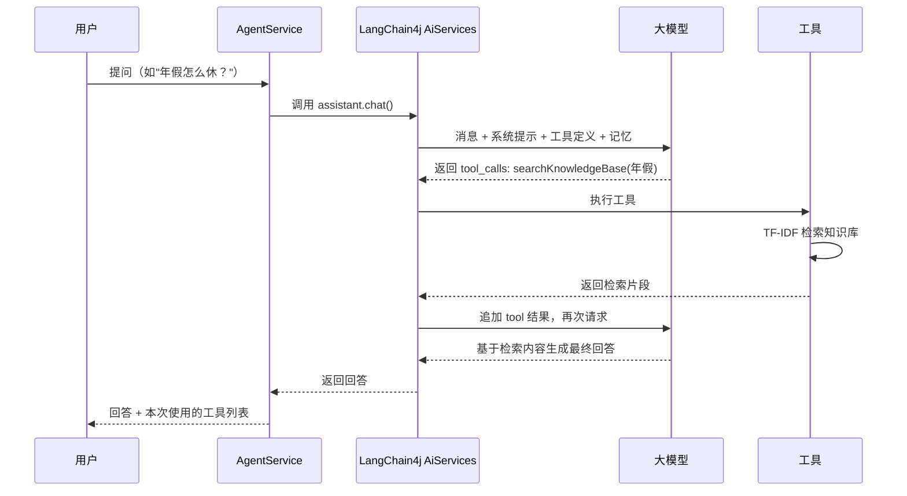

# kb-agent · 企业知识库智能问答 Agent

基于 **Spring Boot 3 + LangChain4j** 实现的智能客服 / 知识库问答 Agent：
大模型通过 **Function Calling（工具调用）** 自主决定调用「知识库检索 / 当前时间 / 安全计算器 / 天气查询」4 个工具，
配合手写实现的 **TF-IDF 中文检索（RAG）** 回答企业内部制度、产品、流程类问题，显著降低模型幻觉。

- 纯 Java 17 + Maven，零数据库、零中间件，`mvn package` 打成一个 jar 即可部署
- 通过配置切换 **DeepSeek / 通义千问 / 智谱 / 豆包** 等任意 OpenAI 兼容大模型
- 知识库为 `resources/kb/` 下的 Markdown 文档，替换成真实文档即可上线
- 自带简易网页聊天界面（`http://localhost:8080`）与 HTTP 接口

## 技术栈

| 模块 | 选型 | 说明 |
|---|---|---|
| 框架 | Spring Boot 3.3.5 | Web 容器 + Bean 管理 |
| Agent 框架 | LangChain4j 1.0.0 | `AiServices` 自动完成工具调用循环 |
| 大模型 | OpenAI 兼容协议（默认 DeepSeek） | 通过 `baseUrl` 切换各家模型 |
| RAG 检索 | 手写实现 TF-IDF + 余弦相似度 | 中文 2-gram 分词，无第三方依赖 |
| 前端 | 原生 HTML/JS | 单页面聊天界面 |
| 构建 | Maven 3.9 + JDK 17 | 单一 fat jar |

## 架构



一次对话的完整流程：



## 目录结构

```
kb-agent
├── pom.xml
└── src/main/
    ├── java/com/lc/kbagent/
    │   ├── config/               # 配置属性（Llm/Agent/Tool）
    │   ├── llm/LlmConfig.java    # ChatModel Bean（OpenAI 兼容）
    │   ├── agent/
    │   │   ├── KbAssistant.java  # AiServices 接口（@SystemMessage）
    │   │   ├── AgentService.java # Agent 门面：装配模型/工具/RAG/记忆
    │   │   └── AgentReply.java
    │   ├── tools/
    │   │   ├── AgentTools.java   # @Tool 工具集合（4 个工具）
    │   │   ├── ExpressionCalculator.java # 安全计算器（递归下降解析）
    │   │   └── ToolCallTracker.java      # 工具调用记录（前端展示）
    │   ├── rag/
    │   │   ├── KnowledgeBase.java        # 知识库加载与切块
    │   │   ├── TfidfIndex.java           # TF-IDF 中文检索
    │   │   └── TfidfContentRetriever.java# 封装为 LangChain4j ContentRetriever
    │   └── web/ChatController.java       # /api/chat /api/tools /api/health
    └── resources/
        ├── application.yml       # 大模型/Agent/工具配置
        ├── static/index.html     # 聊天页面
        └── kb/                   # 知识库文档（示例：虚构"星辰科技"）
```

## 快速开始

1. 到 [DeepSeek 开放平台](https://platform.deepseek.com) 注册，创建 API Key（新用户有免费额度）；
2. 填入 `src/main/resources/application.yml`：

   ```yaml
   llm:
     api-key: sk-xxxxxxxxxxxxxxxx
   ```

3. 启动并访问：

   ```bash
   mvn spring-boot:run
   ```

   浏览器打开 `http://localhost:8080` 即可对话。

没配 Key 也能启动，页面正常打开，只是对话接口会提示未配置。默认知识库是虚构的"星辰科技"示例文档，替换 `resources/kb/` 下的 md 文件即可换成自己的内容。

可以试试：「公司年假怎么休？」「帮我算 (128+64)*3」「北京天气怎么样？」
